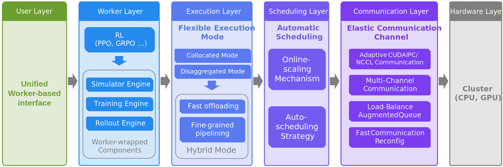

RLinf Documentation
===================

.. raw:: html

   <h1 style="text-align: center;">Welcome to <b>RLinf</b>!</h1>

RLinf is a flexible and scalable open-source infrastructure designed for post-training foundation models via reinforcement learning. The 'inf' in RLinf stands for `Infrastructure`, highlighting its role as a robust backbone for next-generation training. It also stands for `Infinite`, symbolizing the system’s support for open-ended learning, continuous generalization, and limitless possibilities in intelligence development.

----------------

----------------

**RLinf is unique with:**

- Macro-to-Micro Flow: a new paradigm M2Flow, which executes macro-level logical flows through micro-level execution flows, decoupling logical workflow construction (programmable) from physical communication and scheduling (efficiency).

- Flexible Execution Modes

  - Collocated mode: shares all GPUs across all workers.
  - Disaggregated mode: enables fine-grained pipelining.
  - Hybrid mode: a customizable combination of different placement modes, integrating both collocated and disaggregated modes.

- Auto Scheduling

  - Dynamic Scheduling: dynamically schedule resource allocation, maximizing resource utilization.
  - Static Scheduling: automatically select the most suitable execution mode based on the training workload, without the need for manual resource allocation.

- Embodied Agent Support

  - Fast adaptation support for mainstream VLA models: `OpenVLA`_, `OpenVLA-OFT`_, `π₀`_, `GR00T-N1.5`_
  - Support for mainstream CPU & GPU-based simulators via standardized RL interfaces: `ManiSkill3`_, `LIBERO`_, `IsaacLab`_
  - Enabling the first RL fine-tuning of the π₀ model family with a flow-matching action expert.

**RLinf is fast with:**

- Hybrid mode with fine-grained pipelining: achieves a **120%+** throughput improvement compared to other frameworks.
- Automatic Online Scaling Strategy: dynamically scales training resources, with GPU switching completed within seconds, further improving efficiency by 20–40% while preserving the on-policy nature of RL algorithms.

**RLinf is flexible and easy to use with:**

- Multiple Backend Integrations

  .. - A single unified interface drives two complementary backends, allowing seamless switching without code changes.
  
  - FSDP + Hugging Face: rapid adaptation to new models and algorithms, ideal for beginners and fast prototyping.
  - Megatron + SGLang: optimized for large-scale training, delivering maximum efficiency for expert users with demanding workloads.

- Adaptive communication via the asynchronous communication channel

- Built-in support for popular RL methods, including `PPO`_ , `GRPO`_ , `DAPO`_ , `Reinforce++`_ , and more.

.. _PPO: https://arxiv.org/abs/1707.06347
.. _GRPO: https://arxiv.org/abs/2402.03300
.. _DAPO: https://arxiv.org/abs/2503.14476
.. _Reinforce++: https://arxiv.org/abs/2501.03262

.. _OpenVLA: https://github.com/openvla/openvla
.. _OpenVLA-OFT: https://github.com/moojink/openvla-oft
.. _IsaacLab: https://github.com/isaac-sim/IsaacLab
.. _ManiSkill3: https://github.com/haosulab/ManiSkill
.. _LIBERO: https://github.com/Lifelong-Robot-Learning/LIBERO
.. _IsaacLab: https://github.com/isaac-sim/IsaacLab
.. _π₀: https://github.com/Physical-Intelligence/openpi
.. _Megatron-LM: https://github.com/NVIDIA/Megatron-LM
.. _SGLang: https://github.com/sgl-project/sglang
.. _vLLM: https://github.com/vllm-project/vllm
.. _GR00T-N1.5: https://github.com/NVIDIA/Isaac-GR00T.git

--------------------------------------------

.. toctree::
  :maxdepth: 2
  :includehidden:
  :titlesonly:

  rst_source/start/index

--------------------------------------------

.. toctree::
  :maxdepth: 3
  :includehidden:
  :titlesonly:

  rst_source/tutorials/index

--------------------------------------------

.. toctree::
  :maxdepth: 2
  :includehidden:
  :titlesonly:

  rst_source/examples/index

--------------------------------------------

.. toctree::
  :maxdepth: 2
  :includehidden:
  :titlesonly:

  rst_source/blog/index

--------------------------------------------

.. toctree::
  :maxdepth: 2
  :includehidden:
  :titlesonly:

  rst_source/apis/index

--------------------------------------------

.. toctree::
  :maxdepth: 1
  :includehidden:
  :titlesonly:

  rst_source/faq