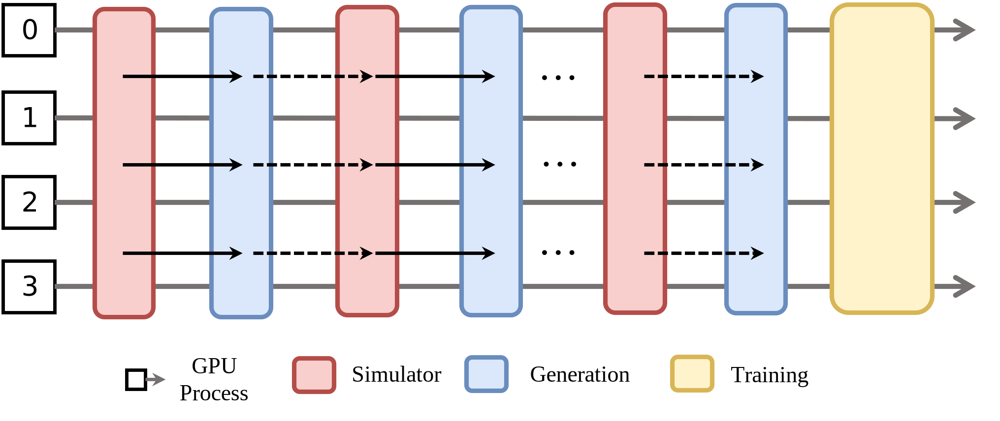

Collocated Mode
===============

All workers are scheduled on the *same* set of GPUs.  During any stage
only one type of worker runs and occupies the entire devices' computation capability until that
stage finishes. There two execution modes: residing in GPU memory simultaneously or switching residence in GPU memory with offloading/reloading.

**Pros**

* Simple design; no complex data-dependency management.

**Cons**

* Often requiring offloading/reloading implementation for each component.
* Long-tail latency in the rollout stage extends end2end RL training time.

**Example configuration**

The following is an example of placing workers. There are two nodes for this training job, each node has 8 GPUs. `actor` uses all the 16 GPUs and `rollout` also uses all the 16 GPUs:

.. code:: yaml

   cluster:
     num_nodes: 2
     component_placement:
       actor,rollout: all # or 0-15

Additonally, some workers support offloading to release GPUs to other workers during some time period. For example, math RL actor support some offloading options:

.. code:: yaml

   actor:
     offload_optimizer: True
     offload_weight: True
     offload_grad: True

If offloading is enabled for actor, the actor is loaded into GPU memory before it runs, then it is offloaded into CPU memory after it finishes its execution. If offloading is not enabled, the collocated workers (assuming workers run on GPUs) will compete for GPU memory, which may lead to OOM error. 
Refer to :doc:`../user/yaml` for the complete configuration.

**ComponentPlacement programming**

Given the above placement configuration, users can use proper `ComponentPlacement` class to parse the configuration and enforce the placement to the workers as below.

.. code:: python

   from rlinf.utils.placement import ModelParallelComponentPlacement, PlacementMode

   component_placement = ModelParallelComponentPlacement(cfg, cluster)
   rollout_placement_strategy = component_placement.get_strategy("rollout")
   rollout_group = SGLangWorker.create_group(cfg, component_placement).launch(
        cluster,
        name=cfg.rollout.group_name,
        placement_strategy=rollout_placement_strategy,
    )

`ModelParallelComponentPlacement` supports two types of placement: collocated and disaggregated. More importantly, it deals with rank arrangement that allows efficient model weight update from training to rollout. It parses the configuration and generates placements for different components. The generated placement is then enforced during worker launching.
Refer to `Math RL training python script <https://github.com/RLinf/RLinf/blob/main/examples/reasoning/main_grpo.py>`_ for the complete code.
