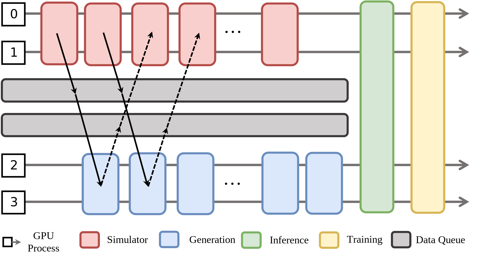

Hybrid Mode
===========

RLinf further augments the collocated mode and disaggregated mode, by introducing hybrid mode: some tasks share the same set of GPUs and some tasks use separate GPUs.

The above figure shows a concrete placement and execution example for an embodied RL training. 
Simulation workers are placed on GPU 0-1, generation workers are placed on GPU 2-3. Two *data queues* decouple producer and consumer rates, 
helping to smooth the pipeline, balance the load, and virtually eliminate performance bottlenecks.After the rollout stage (i.e., simulation+generation), Inference workers are placed and executed on GPU 0-3, and training workers are also on GPU 0-3 afterward. You can see that hybrid mode combines collocated mode and disaggregated mode. The communication utilities (:doc:`../communication/index`) in RLinf facilitate such flexible placement and execution mode.

**Example configuration**

The configuration style of hybrid mode is consistent to collocated/disaggregated mode as shown below. `env` (i.e., simulator workers) is placed on GPU 0-3, `rollout` (i.e., generation workers) is placed on GPU 4-7. They run with pipelining. `actor` (i.e., training workers) are placed on GPU 0-7. When the rollout stage is finished, `env` and `rollout` are offloaded to CPU memory, `actor` is loaded into GPU memory.

.. code:: yaml

  cluster:
    num_nodes: 1
    component_placement:
      actor: 0-7
      env: 0-3
      rollout: 4-7

In most cases, `env`, `rollout`, and `actor` should enable offloading as below to avoid OOM error.

.. code:: yaml

   env:
     enable_offload: True
   rollout:
     enable_offload: True
   actor:
     enable_offload: True

Refer to :doc:`../user/yaml` for compete configuration.

**ComponentPlacement programming**

Different from collocated and disaggregated modes, hybrid mode uses `HybridComponentPlacement`, which has less constraints on worker placement.

.. code:: python 

   from rlinf.utils.placement import HybridComponentPlacement

   component_placement = HybridComponentPlacement(cfg, cluster)
   # Create actor worker group
   actor_placement = component_placement.get_strategy("actor")
   actor_group = FSDPActor.create_group(cfg).launch(
        cluster, name=cfg.actor.group_name, placement_strategy=actor_placement
    )

Refer to `training embodied agent <https://github.com/RLinf/RLinf/blob/main/examples/embodiment/train_embodied_agent.py>`_ for complete code.
