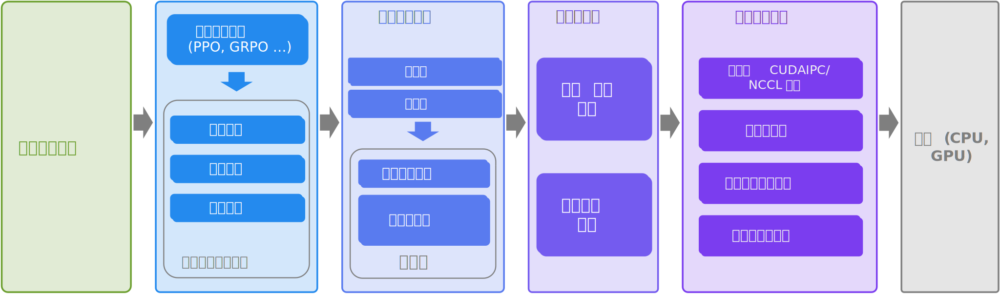

RLinf 文档
==========

.. image:: _static/svg/logo_white.svg
   :width: 500px
   :align: center
   :class: logo-svg

.. raw:: html

   <h1 style="text-align: center;">欢迎来到 <b>RLinf</b>！</h1>

RLinf 是一个灵活且可扩展的开源基础架构，专为通过强化学习对基础模型进行后训练而设计。名称中的 "inf" 代表 Infrastructure（基础架构），强调其作为新一代训练强大支撑系统的角色；同时也代表 Infinite（无限），象征该系统支持开放式学习、持续泛化和智能发展的无限可能性。

----------------

----------------

**RLinf 的独特之处在于：**

- 宏观到微观流程（Macro-to-Micro Flow）：一种新范式 M2Flow，通过微观级的执行流程完成宏观级的逻辑流程，**解耦逻辑工作流构建（可编程）与物理通信调度（高效执行）**。

- 灵活的执行模式

  - **共享式**：所有任务共享全部 GPU。
  - **分离式**：支持细粒度流水线。
  - **混合式**：可定制的混合部署，结合了共享式和分离式两种模式。

- 自动调度策略

  - **动态调度**：动态调度资源分配,最大化资源利用率。
  - **静态调度**：根据训练任务自动选择最合适的执行模式，无需手动资源分配。

- 具身智能支持

  - 快速适配主流 VLA 模型：`OpenVLA`_, `OpenVLA-OFT`_, `π₀`_, `GR00T-N1.5`_
  - 通过标准化 RL 接口支持主流基于 CPU 和 GPU 的模拟器：`ManiSkill3`_、`LIBERO`_、`IsaacLab`_
  - 支持 π₀ 模型族首次基于 flow-matching 动作专家进行的强化学习微调。

**RLinf 拥有出色的训练速度：**

- 结合细粒度流水线的混合式：相比其他框架，**吞吐率提升超过 120%**。
- 自动在线扩缩策略：训练资源动态扩展，GPU 切换只需数秒，**进一步提高效率 20–40%**，同时保持 RL 算法的 on-policy 特性。

**RLinf 同时兼具灵活性与易用性：**

- 多种后端集成支持

  - 统一接口可驱动两种互补的后端，无需修改代码即可无缝切换。
  - **FSDP + Hugging Face**：快速适配新模型与算法，适合初学者与快速原型开发。
  - **Megatron + SGLang**：优化大规模训练效率，适用于对性能要求极高的专家用户。

- 通过异步通信通道实现自适应通信

- 内建对多种主流强化学习方法的支持，包括 `PPO`_、`GRPO`_、`DAPO`_、`Reinforce++`_ 等。

.. _PPO: https://arxiv.org/abs/1707.06347
.. _GRPO: https://arxiv.org/abs/2402.03300
.. _DAPO: https://arxiv.org/abs/2503.14476
.. _Reinforce++: https://arxiv.org/abs/2501.03262

.. _OpenVLA: https://github.com/openvla/openvla
.. _OpenVLA-OFT: https://github.com/moojink/openvla-oft
.. _IsaacLab: https://github.com/isaac-sim/IsaacLab
.. _ManiSkill3: https://github.com/haosulab/ManiSkill
.. _LIBERO: https://github.com/Lifelong-Robot-Learning/LIBERO
.. _IsaacLab: https://github.com/isaac-sim/IsaacLab
.. _π₀: https://github.com/Physical-Intelligence/openpi
.. _Megatron-LM: https://github.com/NVIDIA/Megatron-LM
.. _SGLang: https://github.com/sgl-project/sglang
.. _vLLM: https://github.com/vllm-project/vllm
.. _GR00T-N1.5: https://github.com/NVIDIA/Isaac-GR00T.git

--------------------------------------------

.. toctree::
  :maxdepth: 2
  :includehidden:
  :titlesonly:

  rst_source/start/index

--------------------------------------------

.. toctree::
  :maxdepth: 3
  :includehidden:
  :titlesonly:

  rst_source/tutorials/index

--------------------------------------------

.. toctree::
  :maxdepth: 2
  :includehidden:
  :titlesonly:

  rst_source/examples/index

--------------------------------------------

.. toctree::
  :maxdepth: 2
  :includehidden:
  :titlesonly:

  rst_source/blog/index

--------------------------------------------

.. toctree::
  :maxdepth: 2
  :includehidden:
  :titlesonly:

  rst_source/apis/index

--------------------------------------------

.. toctree::
  :maxdepth: 1
  :includehidden:
  :titlesonly:

  rst_source/faq