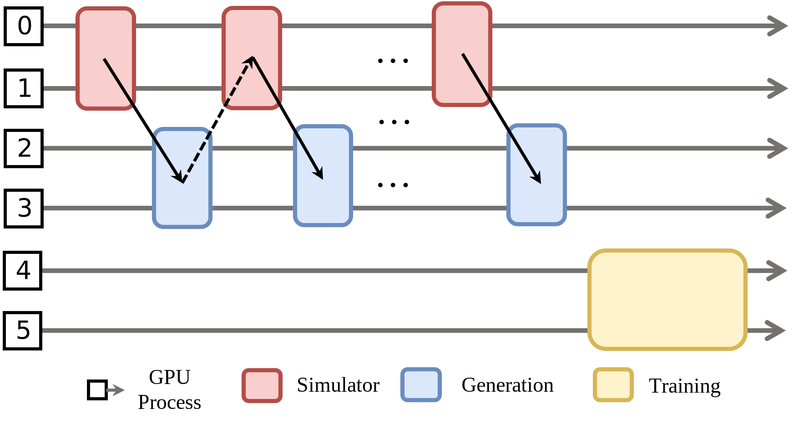

分离式模式
==================

不同的 RL 任务会根据计算需求映射到不同的 GPU 组。这里也有两种执行模式：  
Worker 可以顺序依次运行，或者通过细粒度流水线并发运行。

**优点**

* Worker 分配灵活。  
* 不需要实现卸载功能。  

**缺点**

* 数据流依赖会导致 GPU 空闲。  
* 需要实现流水线来减少 GPU 空闲时间。  

**示例配置**

Worker 被分配到不同的 GPU 上。GPU 集合通过全局 GPU 索引指定。

.. code:: yaml

   cluster:
     num_nodes: 2
     component_placement:
       rollout: 0-9
       inference: 10-11
       actor: 12-15

目前，是否启用流水线取决于底层代码实现。我们还没有公开相关的配置选项。  
如果底层实现了流水线，分离式模式会默认启用流水线。  

**ComponentPlacement 编程**

如 :doc:`collocated` 中所描述，yaml 文件中的放置配置可以通过 `ComponentPlacement` 解析，  
并应用到 Worker 上。完整代码请参考  
`Math RL 细粒度流水训练代码 <https://github.com/RLinf/RLinf/blob/main/examples/reasoning/main_grpo.py>`_。
